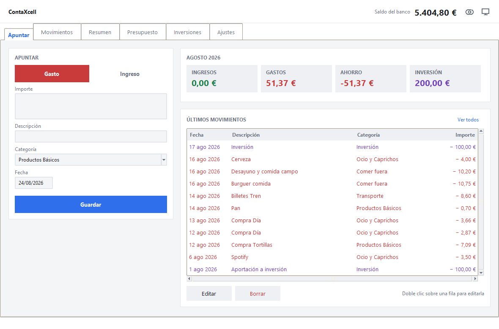
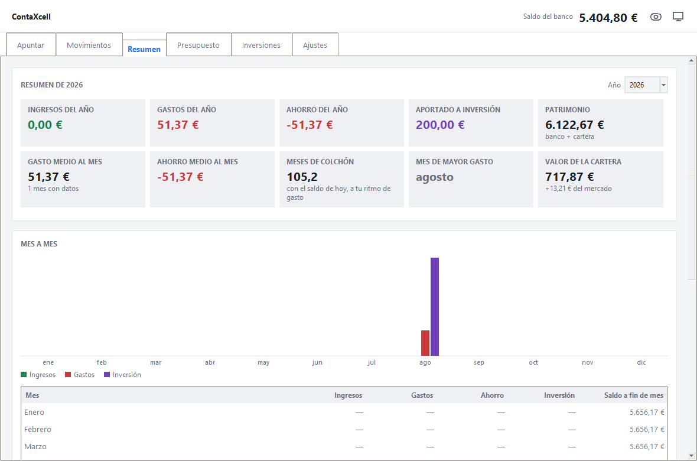
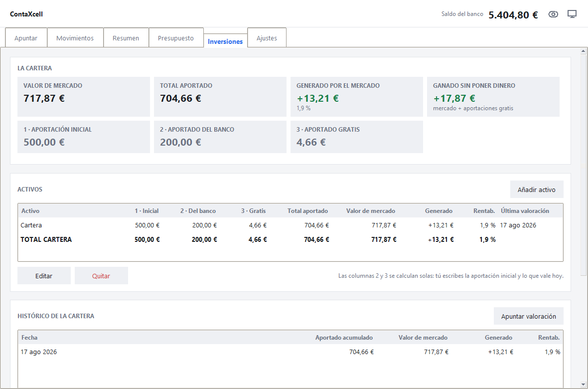
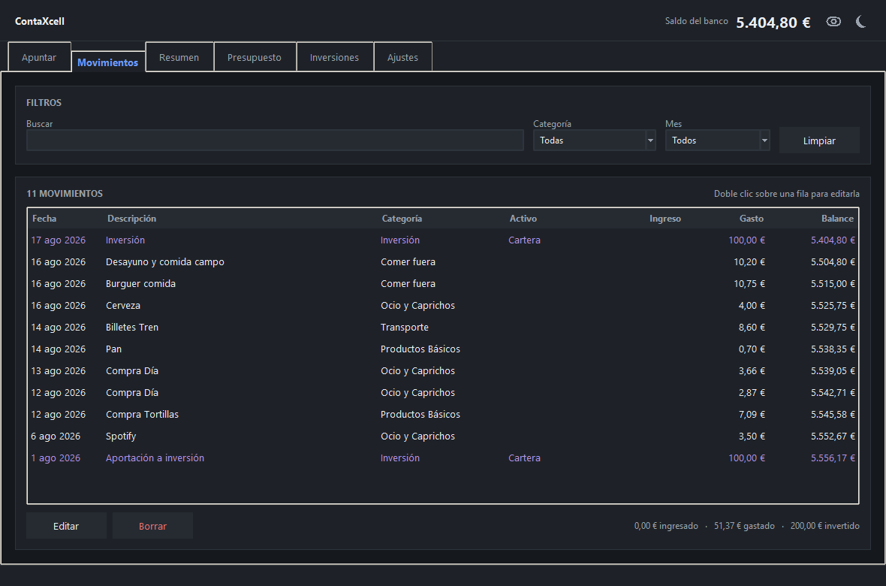

# ContaXcell

Contabilidad personal para Windows. Los datos viven en tu ordenador, en un
archivo tuyo, sin cuentas de Google ni conexión de por medio.

Sustituye a la hoja de cálculo: hace lo mismo que las cuatro hojas de la
plantilla original (Movimientos, Resumen, Presupuesto e Inversiones), pero sin
fórmulas que se puedan romper por escribir en la celda equivocada. Y hace unas
cuantas cosas que la hoja no hacía: los recibos que se repiten se apuntan
solos, las deudas se llevan aparte, el extracto del banco se importa en PDF y
la cartera se revaloriza sola con la cotización de cada fondo.



---

## Empezar

**Con el ejecutable:** descomprime `ContaXcell-windows.zip` donde quieras y
doble clic en `ContaXcell.exe`. No hay que instalar nada.

La primera vez Windows avisará de que no reconoce el programa. Es normal:
significa que no está firmado por una empresa registrada, no que tenga nada
malo. Pulsa **Más información** → **Ejecutar de todas formas**.

**Con el código:**

```
cd escritorio
pip install openpyxl
python ejecutar.py
```

Tkinter, que es la interfaz, ya viene dentro de Python. `openpyxl` solo hace
falta para leer y escribir Excel.

## Traer tu contabilidad desde la hoja de Google

1. En Google Sheets: **Archivo → Descargar → Microsoft Excel (.xlsx)**.
2. En ContaXcell: **Ajustes → Importar desde Excel…** (o `Ctrl+I`).

Se traen los movimientos, las categorías con su tipo, el saldo inicial, los
presupuestos, los activos, el cashback y el histórico de la cartera. Lo que
hubiera en la aplicación se sustituye, pero antes se guarda una copia de
seguridad automática, así que se puede deshacer.

La importación no necesita que la hoja esté intacta: busca las cabeceras en
vez de ir a ciegas por número de fila, así que aguanta filas insertadas o
categorías de más. Si encuentra una categoría que no estaba en el panel, la
añade como gasto y avisa.

## Las pestañas

| | Para qué |
|---|---|
| **Apuntar** | El día a día: importe, concepto, categoría y listo. Con `Intro` se salta de campo y se guarda. |
| **Movimientos** | El libro entero, con buscador y filtros por categoría y mes. Doble clic en una fila para editarla. |
| **Periódicos** | Los recibos y las suscripciones que se repiten. Se apuntan solos el día que toca. |
| **Deudas** | Lo que te deben y lo que debes, con devoluciones a trozos. Aparte del saldo: no es dinero tuyo todavía. |
| **Resumen** | Cómo va el dinero: los meses de un año, un mes suelto o varios años, con gráfico e indicadores. |
| **Presupuesto** | Cuánto tenías previsto gastar en cada cosa y cuánto llevas, con barras de consumo. |
| **Inversiones** | La cartera: qué has aportado, qué vale hoy y qué ha hecho el mercado. |
| **Ajustes** | Saldo inicial, categorías, tema, tu cuenta y el trasiego de archivos. |

**Atajos:** `Ctrl+1`…`Ctrl+8` cambian de pestaña, `Ctrl+H` tapa los importes,
`Ctrl+I` importa, `Ctrl+E` exporta.

El **botón del ojo** de la barra de arriba tapa de golpe todos los importes de
la aplicación, por si apuntas algo con gente delante. Se recuerda al cerrar.



## Las dos reglas que gobiernan las cuentas

Son las mismas de la plantilla, y explican todos los números.

**1. La inversión no es un gasto.** Sale del banco igual que un gasto, pero el
dinero sigue siendo tuyo. Por eso hay tres tipos de movimiento y no dos:

```
Saldo del banco = inicial + ingresos − gastos − inversión
Ahorro          = ingresos − gastos            (la inversión no resta)
Flujo neto      = ahorro − inversión           (aquí sí)
```

**2. Solo el mercado genera rentabilidad.** Hay tres formas de que entre
dinero en la cartera, y ninguna de las tres es ganancia:

```
Total aportado = aportación inicial + aportado del banco + aportado gratis
Generado       = valor de mercado − total aportado
```

El cashback y las promociones son *aportado gratis*: aumentan la cartera sin
salir de tu cuenta, así que no se apuntan como ingreso ni como gasto. Van en
su propia tabla, dentro de Inversiones.

El **tipo lo manda la categoría**. Si cambias «Transporte» de Gasto a Ingreso,
se recalcula todo su histórico. Y si renombras una categoría, sus movimientos
la siguen.



## Los recibos que se repiten

Un periódico no es un movimiento: es la receta para fabricarlos. Se apunta una
vez (el alquiler, una suscripción, la aportación mensual al fondo) y al abrir
la aplicación se convierten en movimientos normales los que hayan vencido,
nunca por delante de hoy. Semanal, quincenal, mensual, bimestral, trimestral,
semestral o anual.

- Cada regla recuerda hasta dónde ha apuntado, y esa marca **solo avanza**: un
  movimiento borrado a mano no vuelve a aparecer solo.
- Se pueden **apagar** (deja de apuntar, y al encenderlo otra vez no rellena
  los meses de en medio) o ponerles fecha de fin, que es **terminarlos**.
- El día sale siempre de la fecha del primer pago, así que un recibo del 31
  vuelve al 31 después de febrero.
- Una aportación mensual al fondo con categoría de inversión aporta a la
  cartera en vez de contar como gasto, porque el tipo lo manda la categoría.

En **Apuntar** hay una casilla «se repite» que crea la regla a partir del
apunte que acabas de escribir: ese movimiento es ya el primer pago, así que no
se duplica ni se rellena nada anterior.

## Las deudas

Que alguien te deba veinte euros no es tenerlos. Por eso las deudas son una
libreta aparte: **no tocan el saldo ni el ahorro**. Se apunta quién, cuánto y
de qué, y se va marcando lo devuelto a trozos.

Cobrar o pagar una deuda **ofrece** apuntar un movimiento, pero no lo fabrica
sola: si pagaste tú la cena entera, ese gasto ya salió de tu cuenta y lo que te
devuelven solo lo compensa. Apuntarlo también lo contaría dos veces.

## Traer el extracto del banco

En **Inversiones → Importar de Trade Republic** se lee el «Certificado de saldo
y movimientos» en PDF, sin librerías de por medio. Trae las compras del plan de
inversión con las participaciones que compró cada una, los intereses y las
bonificaciones.

- Los **intereses** se quedan en la cuenta: son un ingreso.
- La **bonificación** se reinvierte sola a los pocos días, así que es *aportado
  gratis*. Se empareja con su compra por importe exacto dentro de diez días; la
  que no encuentre pareja se queda como ingreso, que es lo que es.
- Si ya habías apuntado a mano «400 € a inversión» cada mes, la importación lo
  detecta y pregunta si sustituir esos apuntes por las compras de verdad. Si no,
  la cartera diría que metiste el doble.
- Importar dos veces no duplica: los repetidos se reconocen por fecha, importe
  y participaciones.

Con los títulos de cada compra se ve cómo va cada una por separado: los mismos
100 € compran más participaciones cuando el fondo está barato. El precio de hoy
no se apunta, sale de dividir el valor de mercado entre los títulos.

Cada activo se puede enlazar además con su **cotización de bolsa**, y entonces
el valor de mercado se actualiza solo una vez al día. Los precios los sirve el
servidor, que guarda el histórico para todo el grupo.

## Dónde están tus datos

En `%APPDATA%\ContaXcell\`, que es tu carpeta de usuario. Desde la aplicación:
**Ajustes → Abrir la carpeta**.

- `datos.json` — toda tu contabilidad, en texto legible.
- `copias\` — copias de seguridad fechadas. Se guardan las veinte últimas.
- `ventana.json` — el tamaño de la ventana. Se puede borrar sin consecuencias.

Se guarda **cada vez que cambias algo**, no hay botón de guardar. La escritura
es en dos pasos (archivo temporal y luego cambio de nombre), así que un corte
de luz a mitad no puede dejar el archivo partido.

Antes de importar o restaurar siempre se hace una copia automática. Si el
archivo llegara a estropearse, la aplicación lo aparta en vez de sobrescribirlo
y avisa al abrir.

**Exportar a Excel** genera la plantilla original de siempre, rellena con tus
datos: las cuatro hojas con sus fórmulas vivas, sus textos y sus colores, lista
para seguir usándola en Excel o en Google Sheets. Si tienes más movimientos o
categorías de los que la plantilla traía, las tablas crecen y las fórmulas se
ajustan solas. Ese archivo se puede volver a importar sin perder nada: es la
vía de escape si algún día quieres irte.

## Hacer el ejecutable para repartir

```
cd escritorio
pip install pyinstaller
python empaquetar.py
```

Deja en `dist\` la carpeta `ContaXcell` (unos 25 MB) y un
`ContaXcell-windows.zip` (unos 12 MB) listo para enviar.

Se empaqueta **en carpeta y no en un único archivo** a propósito. Un `.exe` de
un solo archivo se descomprime en una carpeta temporal cada vez que se abre,
que es justo lo que hace el software malicioso, y por eso los antivirus lo
marcan mucho más a menudo. La carpeta arranca antes y da menos disgustos al
mandársela a alguien.

Ese aviso de Windows (SmartScreen) solo desaparece comprando un certificado de
firma de código, que cuesta unos cientos de euros al año. Para repartir entre
amigos no compensa.

Cada persona lleva su propia contabilidad en su ordenador. Nadie ve la de
nadie. Para dar una versión nueva basta con sustituir la carpeta: los datos
están en otro sitio y no se tocan.

## La cuenta y la sincronización

La aplicación puede trabajar contra un servidor propio (el de `server/`, que se
levanta con Docker y guarda los libros en PostgreSQL). Al abrirla por primera
vez pide crear una cuenta o entrar; a partir de ahí abre directa, haya internet
o no.

El servidor **ya está desplegado** en una instancia EC2 de Amazon, encendida
todo el día y por HTTPS, y **su dirección viene puesta de fábrica**: quien
recibe el programa solo tiene que poner usuario y contraseña. Si el servidor
pide **código de invitación**, aparece un campo más al crear la cuenta; sin ese
código, nadie que dé con la dirección puede registrarse. Para apuntar a otro
servidor (uno de pruebas en tu propio ordenador, por ejemplo) hay un enlace
**Cambiar el servidor…** en la ventana de entrada.

### De dónde sale esa dirección

No está escrita en el código: es un dato de cada despliegue y en un
repositorio público no pinta nada. Se busca en este orden:

1. La variable de entorno `CONTAXCELL_SERVIDOR`, para apuntar a otro sitio un
   rato sin tocar ningún archivo.
2. El archivo `escritorio/.env`, que **no se sube a git** (hay un
   `.env.ejemplo` al lado que explica qué poner). `empaquetar.py` lo mete
   dentro del programa y **se niega a empaquetar si falta**, que si no saldría
   un ejecutable apuntando a `localhost` y nadie podría entrar.
3. Si no hay ninguna de las dos cosas, `http://localhost:8000`: es lo único
   que se puede suponer en un clon recién bajado, y es lo que vale para probar
   con `docker compose up -d`.

Que no esté en el repositorio **no la hace secreta**: el `.env` viaja dentro
del `.exe` que repartes y cualquiera que lo reciba puede leerla. Lo que guarda
la puerta es el código de invitación, la contraseña de cada uno y el https, no
que nadie sepa dónde está la máquina.

Si esa dirección deja de contestar —la máquina de AWS se reinicia sin IP fija y
le toca otra—, la ventana de entrada no dice «revisa la dirección», que no es
cosa del usuario: dice que compruebe su internet y, si lo tiene, que **se ponga
en contacto con quien administra ContaXcell**. Arreglarlo es cambiar el `.env`
y repartir el programa otra vez, o dar la dirección nueva para escribirla en
*Cambiar el servidor…*. Con una **IP elástica** en la instancia, esto no pasa.

El funcionamiento sigue siendo el de siempre: **todo se guarda primero en tu
disco**, en `datos.json`, y un hilo aparte lo sube a tu cuenta cuando hay
conexión. Sin internet no cambia nada: se apunta que queda algo pendiente
(sobrevive a cerrar la aplicación) y se sube solo en cuanto vuelve la
conexión. Al entrar desde otro ordenador, se descarga el libro de la cuenta.

Si dos ordenadores suben a la vez, gana el último en subir, pero lo del otro
no se pierde: queda una copia fechada en `copias\`. Cerrar sesión está en
**Ajustes → Tu cuenta**. Cambiar la contraseña cierra la sesión en los demás
ordenadores, que es lo que permite echar a la calle una que se haya quedado
donde no debía. Con la variable de entorno `CONTAXCELL_SIN_CUENTA=1` la
aplicación funciona como antes, todo en local y sin cuenta.

Cómo levantar el servidor, en local o en un EC2 con su certificado, está
contado paso a paso en `server/LEEME.md`.

## Tema claro y oscuro

Sigue al sistema por defecto, y se puede fijar desde **Ajustes** o con el botón
de la barra de arriba.



## Cómo está montado

```
ContaXcell/
├── escritorio/                la aplicación
│   ├── ejecutar.py            arranque (y punto de entrada de PyInstaller)
│   ├── empaquetar.py          crea el .exe y el .zip
│   ├── contaxcell/
│   │   ├── modelo.py          qué es un movimiento, una categoría, un activo…
│   │   ├── calculos.py        toda la aritmética. No sabe que existe una ventana
│   │   ├── almacen.py         leer y guardar en disco, copias de seguridad
│   │   ├── sincronia.py       subir y bajar el libro del servidor, sin tocar la ventana
│   │   ├── acceso.py          la puerta de entrada: crear cuenta y entrar
│   │   ├── excel.py           importar y exportar .xlsx
│   │   ├── traderepublic.py   lee el extracto del banco en PDF, sin librerías
│   │   ├── tema.py            colores y estilos, claro y oscuro
│   │   ├── formato.py         cómo se enseñan cifras y fechas; el botón del ojo
│   │   ├── widgets.py         tarjetas, tablas, barras, gráficos
│   │   ├── dialogos.py        formularios y confirmaciones
│   │   ├── ventana.py         la ventana principal y el estado compartido
│   │   └── vistas/            una pestaña por archivo
│   ├── pruebas/
│   └── recursos/
│       └── hacer_icono.py     dibuja el icono sin librerías de imágenes
├── server/                    el servidor de cuentas y sincronización (Docker)
│   ├── contaserver/           la API: cuentas, fichas de sesión, libros y precios
│   ├── docker-compose.yml     la API, su PostgreSQL y el Caddy del HTTPS
│   └── LEEME.md               cómo levantarlo y desplegarlo
├── app/                       versión anterior para el móvil (Google Apps Script)
└── capturas/
```

La separación que importa: **`calculos.py` no toca disco ni interfaz**. Recibe
un `Libro` y devuelve datos. Por eso se puede probar entero sin abrir una
ventana, y por eso las pruebas tardan un momento. `sincronia.py` va por el
mismo camino: el hilo de fondo no toca la ventana, deja los avisos en una cola
que la ventana vacía desde el hilo principal.

Las vistas nunca cambian los datos por su cuenta: llaman a `app.cambiar(...)`,
que aplica el cambio, lo guarda en disco y avisa a las pestañas de que se han
quedado anticuadas. Así nunca se enseña algo que en realidad no se ha grabado.

## Pruebas

```
cd escritorio
python -m unittest discover -s pruebas    # 350 pruebas, unos 8 segundos
python pruebas/humo.py                    # abre la ventana y pasea las pestañas
python pruebas/ver.py --pestana resumen   # abre con datos de prueba

cd server
python -m unittest discover -s pruebas    # 75 pruebas, con SQLite y sin red
```

`ver.py` usa una carpeta de datos aparte, así que nunca toca la contabilidad de
verdad. Con `--captura foto.png` hace una imagen y se cierra, que es la forma
rápida de revisar cómo queda una pantalla.

La prueba que más vale de todas es la de ida y vuelta de Excel: importar un
libro, exportarlo y volver a importarlo tiene que dar exactamente lo mismo.

## Cosas que conviene saber

- **Las fechas se guardan como texto** `AAAA-MM-DD`. Se ordenan y se comparan
  solas, y así ninguna zona horaria puede restar un día.
- **Los importes se guardan siempre en positivo.** El signo lo decide la
  categoría. Guardar un negativo restaría dos veces al cambiar de categoría.
  En la ventana, las casillas de importe y de fecha no dejan teclear letras;
  solo el saldo inicial admite el menos, que se puede empezar en números rojos.
- **El redondeo es a la española**, no el de Python: 2,675 → 2,68. El `round`
  normal redondea al par más cercano y da 2,67, que despista mirando una cuenta.
- **Los títulos van con seis decimales**, no con dos: un fondo se compra por
  fracciones, y 0,795628 participaciones no son 0,80.
- **Sin valorar no es valer cero.** Un activo del que nadie ha dicho todavía lo
  que vale se da por hecho que vale lo aportado, y lo generado sale cero, en vez
  de anunciar que has perdido todo lo que metiste. Un cero **con fecha** sí es
  valer cero, y se respeta.
- **Las medias del resumen van siempre por mes**, sea el periodo el que sea.
  Repartir tres años de gastos entre tres tramos daría un «gasto medio al mes»
  de diez mil euros.
- **El presupuesto es una cifra por categoría** y vale para todos los meses, tal
  como estaba en la plantilla. Lo que cambia cada mes es el gasto real.

## La versión del móvil

En `app/` está la versión anterior: una aplicación web en Google Apps Script
que escribía directamente en la hoja de Google desde el navegador del móvil.
Funciona, pero obliga a pelearse con el selector de cuenta de Google y a que
cada persona pase por la pantalla de «aplicación no verificada». Se quedó
retirada al pasar al escritorio; ahí sigue por si alguna vez hace falta.

## Licencia

MIT.
